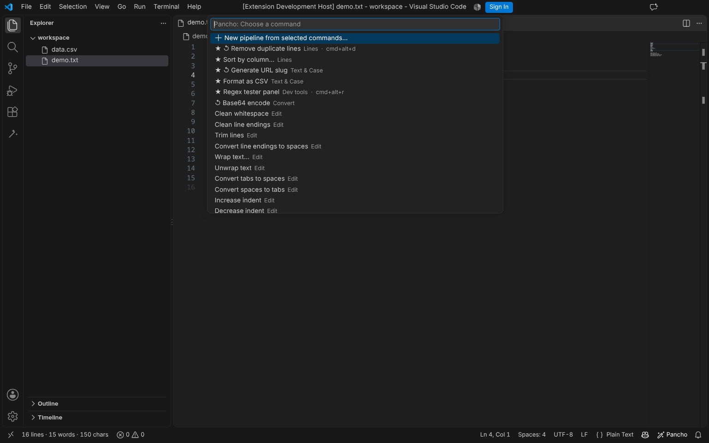
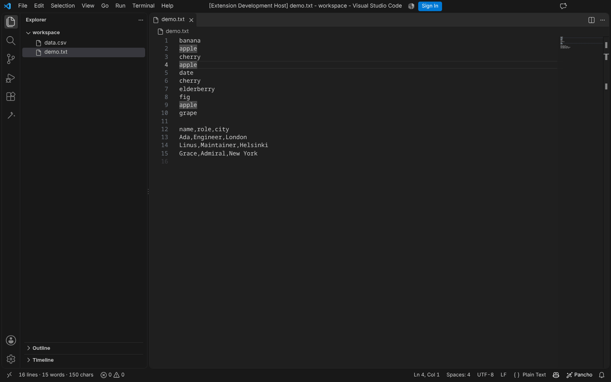
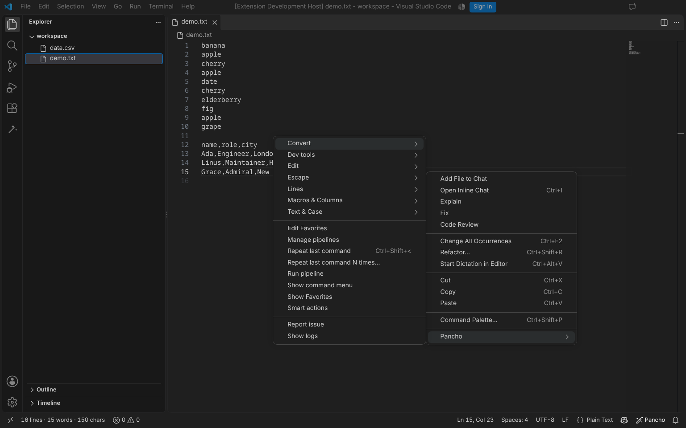
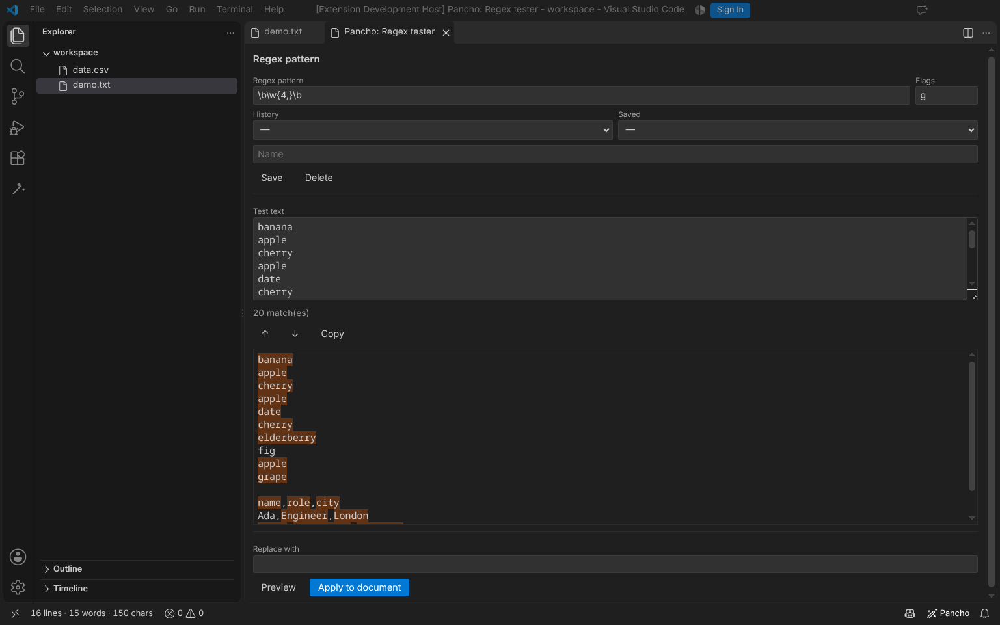
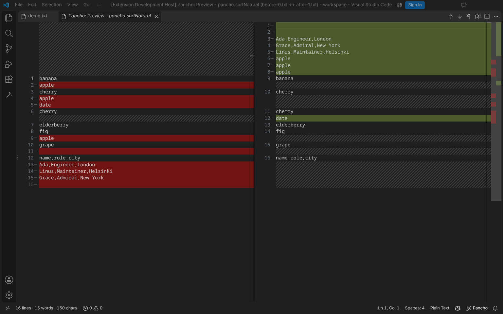
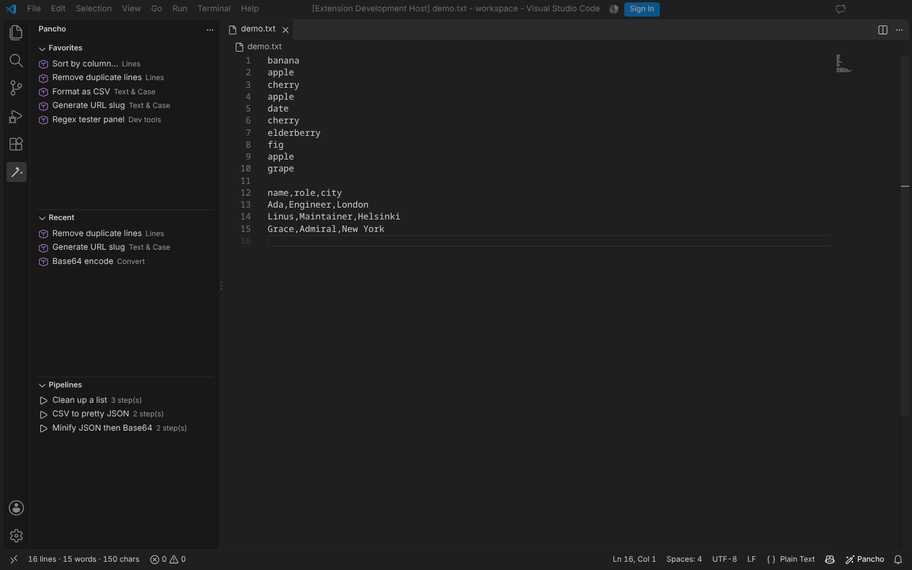
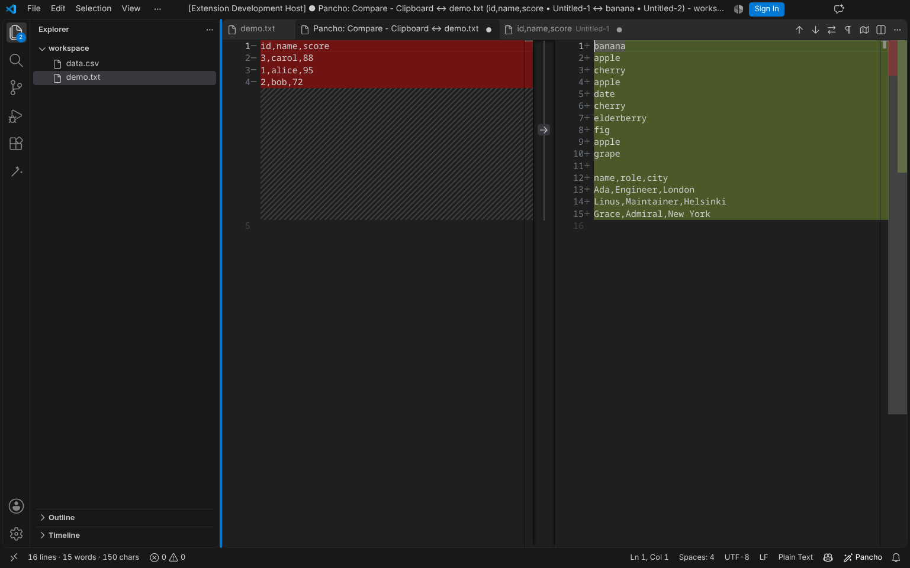

# Pancho

[](../CHANGELOG.md)
[](../LICENSE)
[](https://code.visualstudio.com/)
[](https://www.typescriptlang.org/)

> Limpia, formatea y transforma texto como Notepad++

**Idioma:** [English](../README.md) · Español

**Índice:** [Capturas](#capturas) · [Características](#características) · [Top 10](#top-10-comandos) · [Cómo usar](#cómo-usar) · [Comandos](#comandos) · [Demos](./demos.md) · [Atajos](#atajos-de-teclado) · [Configuración](#configuración)

---

## Capturas





| | |
|---|---|
|  |  |
|  |  |



_Se regeneran con `npm run capture` (ver [scripts/capture](../scripts/capture))._

## Instalación

- **VS Code Marketplace:** [Pancho++](https://marketplace.visualstudio.com/items?itemName=undaniels.pancho-plus-plus)
- **Open VSX:** [undaniels/pancho-plus-plus](https://open-vsx.org/extension/undaniels/pancho-plus-plus)
- O ejecuta `ext install undaniels.pancho-plus-plus`.

---

## Características

- **149 comandos** accesibles desde el menú contextual
- **Hub de comandos** (`Pancho: Mostrar menú de comandos`) con categorías, atajos y usados recientemente
- **Comparar con el portapapeles** (`Pancho: Comparar con el portapapeles`): diff editable lado a lado entre el portapapeles y la selección (o el archivo completo)
- **Compatible con multi-cursor y multi-selección**: las transformaciones se aplican por cursor/selección
- **Repetir último comando** (`Ctrl+Shift+.`)
- **Vista previa (diff)** para comandos que eliminan o reordenan contenido (activa por defecto)
- **Vista en la barra de actividad** con **Favoritos**, comandos **Recientes** y **Pipelines**
- **Pipelines**: encadena transformaciones en orden, previsualiza el resultado y guárdalos o compártelos
- **Funciona en el navegador** (`vscode.dev`), en el escritorio y en Remote/WSL/Containers
- **Settings Sync** para favoritos, pipelines, regex guardadas y macros
- **Acciones inteligentes**: un selector para el contenido bajo el cursor (JWT, JSON, CSV, color, Base64, timestamp)
- **Hover contextual** con acciones de un clic
- **Modo columna**: insertar / eliminar / copiar / pegar bloques de columna
- **Macros**: grabar, reproducir, guardar y exportar/importar secuencias de comandos
- **Información al pasar el mouse**: decodifica JWT, timestamps, colores y Base64 solo con el hover
- **Quick fixes** (Code Actions): detecta JWT / JSON / CSV / hex y convierte en el sitio
- **Panel de test de regex** con coincidencias en vivo, grupos y vista previa de reemplazo
- **Historial de portapapeles** (`Ctrl+Alt+V`) y **ordenar por columna**
- **Motor de regex seguro** con timeout (sin ventanas congeladas)
- **Contadores en barra de estado** (líneas, palabras, caracteres)
- **Atajos de teclado** para operaciones frecuentes
- **Configuración** de tabulación, EOL y más
- **Interfaz en inglés y español** (sigue el idioma de VS Code)

## Top 10 comandos

¿Primera vez? Estos son los que más se usan:

| Comando | Qué hace | Atajo |
|---------|----------|-------|
| Mostrar menú de comandos | Hub con buscador de todo lo que hace Pancho | — |
| Ordenar por columna... | Ordena filas CSV/TSV por una columna | — |
| Eliminar líneas duplicadas | Quita duplicados de una lista | `Ctrl+Alt+D` |
| Panel de test de regex | Coincidencias en vivo, grupos y reemplazo | `Ctrl+Alt+R` |
| Historial de portapapeles... | Re-pega algo que copiaste hace poco | `Ctrl+Alt+V` |
| Decodificar JWT | Decodifica un token (también hover / quick fix) | — |
| Columna: rellenar serie... | Rellena una columna con una serie incremental | — |
| CSV a JSON / JSON a CSV | Convierte datos tabulares en ambos sentidos | — |
| Macro: grabar y reproducir | Automatiza ediciones repetitivas | — |
| Alinear por = | Alinea asignaciones / tablas | — |

Más ejemplos en [demos.md](./demos.md).

## Por qué Pancho

- **Memoria muscular de Notepad++** en VS Code: las mismas operaciones de texto, en el menú contextual.
- **Consciente del contexto:** pasa el mouse por un JWT/timestamp/color y lo ves decodificado; selecciona JSON/CSV/JWT y conviértelo con la bombilla.
- **Seguro por diseño:** sin red, sin telemetría, regex en un worker con timeout, AES-256-GCM.
- **Chico pero completo:** una extensión para formateo, escapado, hashing, codificación, CSV, macros y columnas.

## Privacidad y seguridad

- **Sin telemetría ni acceso a red.** Pancho funciona completamente en local y nunca envía tu texto a ningún sitio.
- **Motor de regex seguro.** Las expresiones regulares del usuario se ejecutan en un worker thread aislado con timeout, así un patrón catastrófico no puede congelar VS Code.
- **Cifrado autenticado.** El cifrado AES usa AES-256-GCM con salt aleatorio por mensaje (los datos antiguos en CBC siguen siendo legibles).
- **Consciente del workspace trust.** Pancho declara soporte limitado en workspaces no confiables y no requiere acceso a red.

## Cómo usar

1. Selecciona texto (o no, para aplicar a todo el documento)
2. Clic derecho → **Pancho**
3. Elige la categoría y el comando

## Comandos

Los **149 comandos** se agrupan en siete categorías para que el menú contextual sea corto: **Editar**, **Líneas**, **Texto y mayúsculas**, **Convertir**, **Escapar**, **Desarrollo** y **Macros y columnas**, más el **Hub de comandos**.

Lista completa con descripciones: **[Comandos de Pancho](./commands.es.md)**.

## Integraciones con VS Code

Algunos comandos conservan su entrada de menú y atajo de Pancho pero **delegan en la implementación nativa de VS Code** (consistencia y soporte multi-cursor): mayúsculas / minúsculas / título, comentar y comentar bloque, tabs↔espacios, indentar/desindentar, mover / duplicar / insertar línea, ordenar A–Z / Z–A y unir líneas.

## Atajos de teclado

| Atajo (Win/Linux) | Atajo (Mac) | Comando |
|-------|-------|---------|
| `Ctrl+Shift+U` | `Cmd+Shift+U` | Mayúsculas |
| `Ctrl+Shift+C` | `Cmd+Alt+C` | Contar caracteres |
| `Ctrl+Alt+D` | `Cmd+Alt+D` | Eliminar duplicados |
| `Ctrl+Shift+.` | `Cmd+Shift+.` | Repetir último comando |
| `Ctrl+Alt+V` | `Cmd+Alt+V` | Historial de portapapeles |
| `Ctrl+Alt+R` | `Cmd+Alt+R` | Panel de test de regex |

> Estos son los únicos atajos que Pancho asigna por defecto. El resto está a dos
> clics en el menú contextual o en el hub de comandos, de modo que Pancho no
> pisa los atajos propios de VS Code (`Ctrl+Shift+D` es *Show Run and Debug*,
> `Ctrl+Shift+S` es *Guardar como*, `Ctrl+Shift+L/T/W/N` son comandos del
> editor/ordenación, …).
>
> Alguno sigue chocando a nivel de sistema en ciertas plataformas
> (`Ctrl+Shift+U` es "insertar Unicode" en Linux). Si te molesta, reasígnalos en
> **Atajos de teclado** (`Ctrl+K Ctrl+S`) buscando `pancho`.

## Configuración

| Opción | Default | Descripción |
|--------|---------|-------------|
| `pancho.tabSize` | `4` | Tamaño de tabulación |
| `pancho.defaultEOL` | `LF` | Fin de línea por defecto |
| `pancho.statusBarShowCounters` | `true` | Mostrar contadores |
| `pancho.maxFileSizeKB` | `5120` | Tamaño máximo de archivo |
| `pancho.loremIpsumWordCount` | `50` | Palabras en Lorem Ipsum |
| `pancho.randomStringLength` | `16` | Longitud de string aleatorio |
| `pancho.regexTimeoutMs` | `2000` | Tiempo máximo (ms) de una regex antes de abortar |
| `pancho.previewDestructive` | `true` | Mostrar diff antes de comandos destructivos |
| `pancho.clipboardHistoryEnabled` | `false` | Registra el portapapeles en segundo plano (opcional) |
| `pancho.clipboardHistorySize` | `20` | Máximo de entradas del portapapeles |

## Contadores en barra de estado

Pancho muestra `L:X P:Y C:Z` (Líneas, Palabras, Caracteres) en la barra de estado. Cuando hay selección cambia a `Sel L:X P:Y C:Z` para distinguir el conteo de la selección del total del documento.

---

## Contribuir

Issues y pull requests en [github.com/undaniel/pancho](https://github.com/undaniel/pancho).

```bash
npm install
npm run compile   # typecheck
npm test          # tests unitarios
npm run l10n:check
npm run bundle    # genera dist/
```

Luego pulsa `F5` en VS Code para lanzar el Extension Development Host. Historial de versiones en [CHANGELOG.md](../CHANGELOG.md).

## Licencia

[MIT](../LICENSE) © Daniel Carrasco
